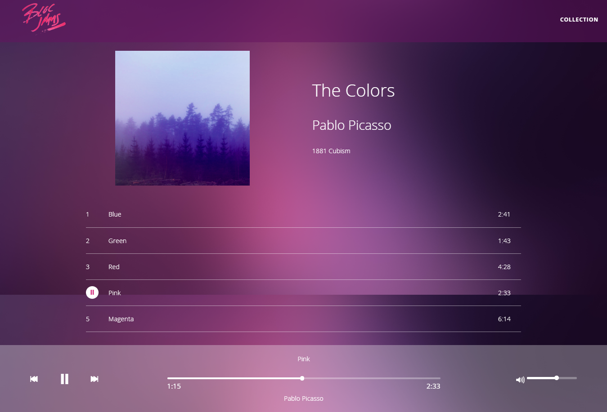

# Bloc Jams

A digital music player like Spotify that I built to learn frontend web development.

[Case Study](https://samibirnbaum.com/portfolio/blocjams.html)

## Usage

1. Fork and clone the repo: `git clone https://github.com/samibirnbaum/bloc-jams-angularjs.git`
2. Run `$ npm install` to download/install the needed dependencies
3. Start the node server: `npm start`.
4. Open a web browser, and go to `http://localhost:3000`.

